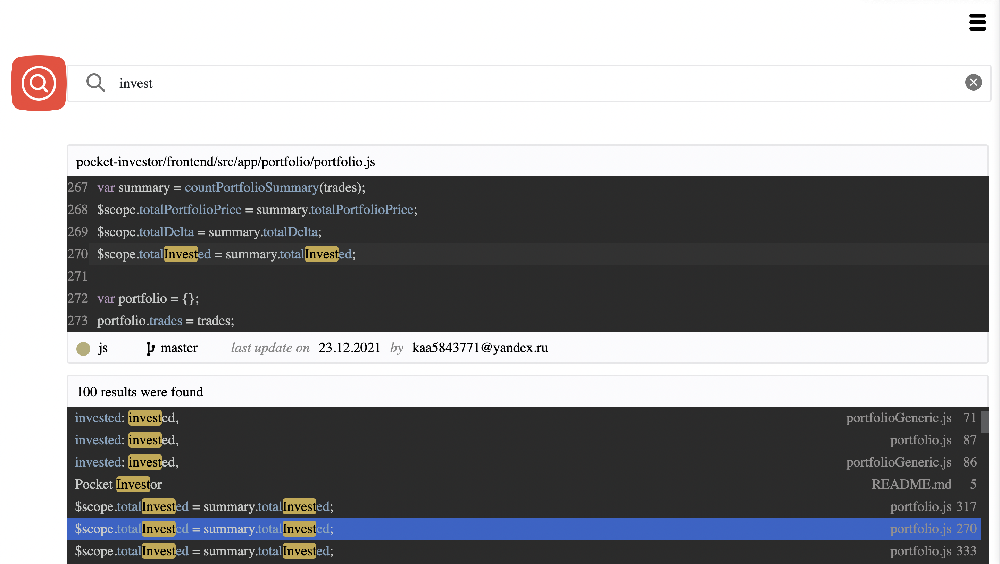
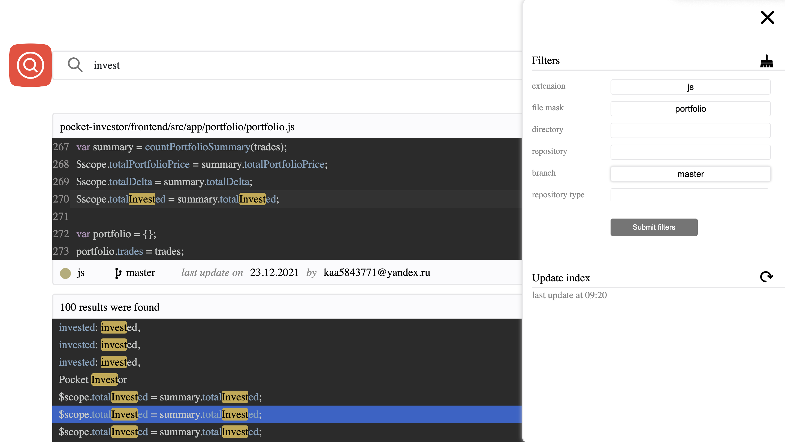
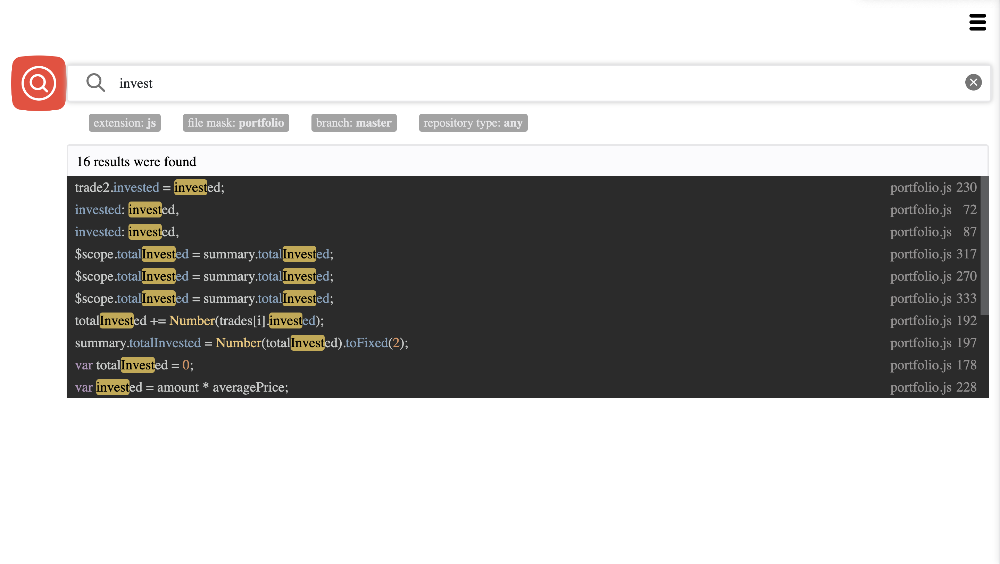
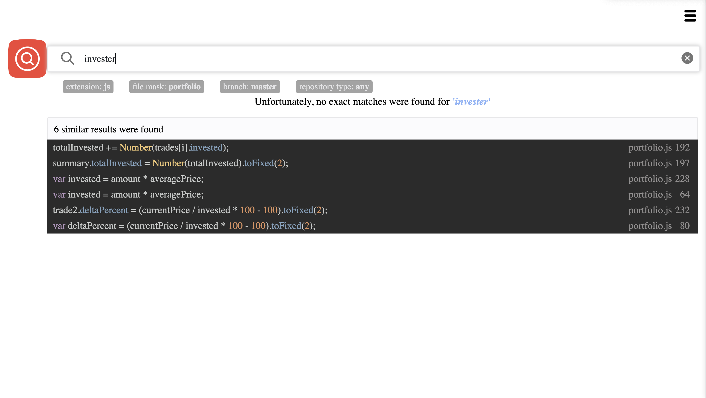
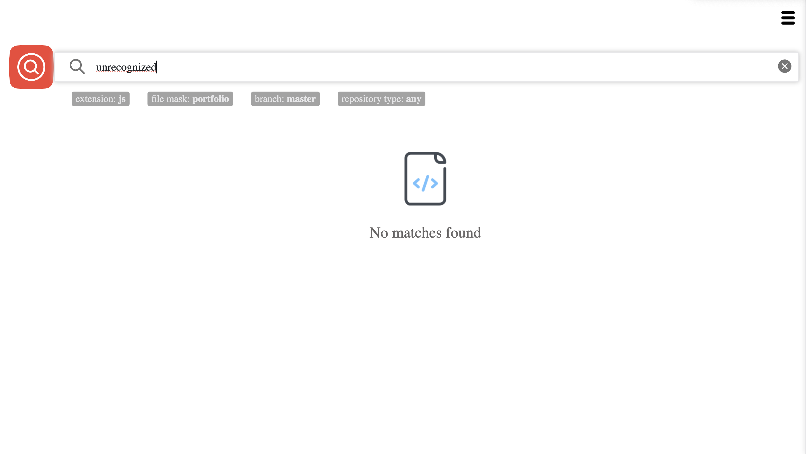

# Git Search App

**Git Search App** is an application for fulltext search through source code in GitHub repositories.
Supports exact search for the given string, fuzzy search and a filtered search.

Application automatically synchronizes its state with GitHub, updating local indexes every 30 minutes.

A list of repositories to be scanned should be provided in `config/repositories.json` file.

## How to use

To find a piece of code simply write it in the search window. 
Found results will be presented as a list of clickable elements.
Clicking on an element opens a window containing a code snippet 
and some additional meta information

To execute a search with filters open the menu and insert all required filters.
Following filters are supported:
- file extension
- file name mask
- file directory mask
- repository
- branch
- repository type (development/implementation). This filter can be useful for product companies with controlled repositories for client delivery

Provided filters will be listed below the search string

In case no exact results were found fuzzy search will be applied

In case no result were found at all a corresponding message will be shown

## Intentions

This application was developed as a graduate work for Saint Petersburg State University. 
Later it was modified and forked by 'Solanteq' company.